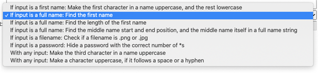

Users type in a string in the input type=text field and select one of the options on how to process the string.'

When a user click the "generate output" button, it processes whatever is in the inputbox, and writes the result in the output box.
